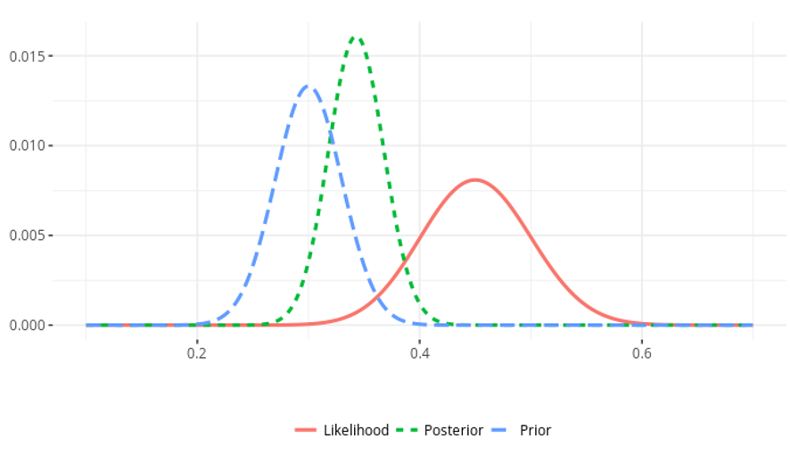
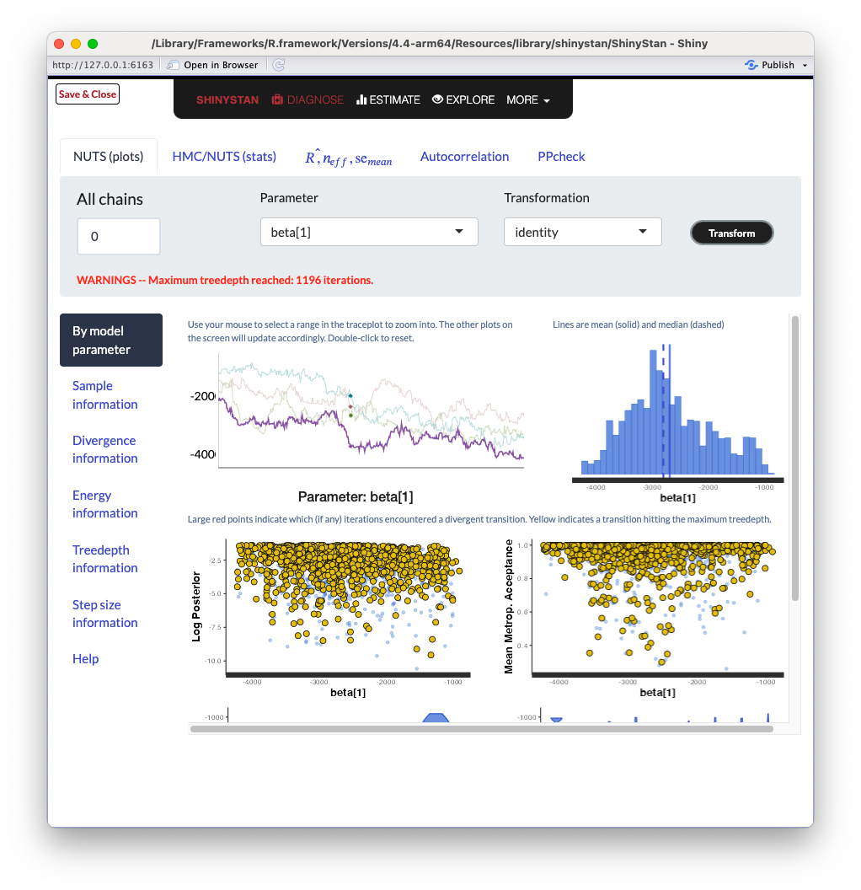
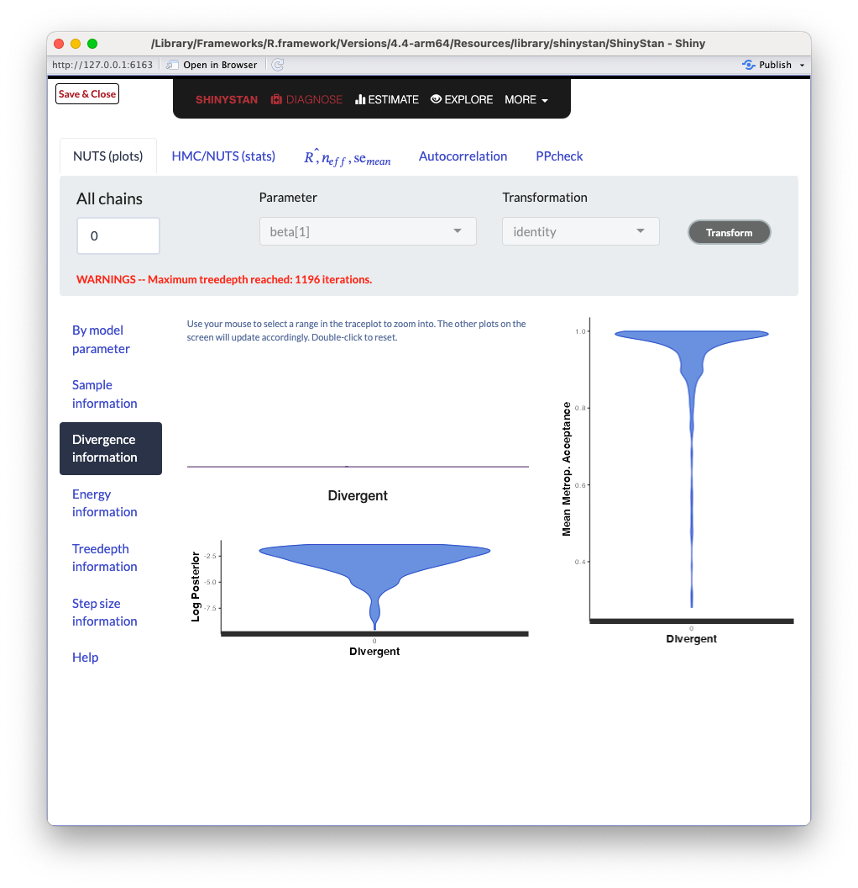
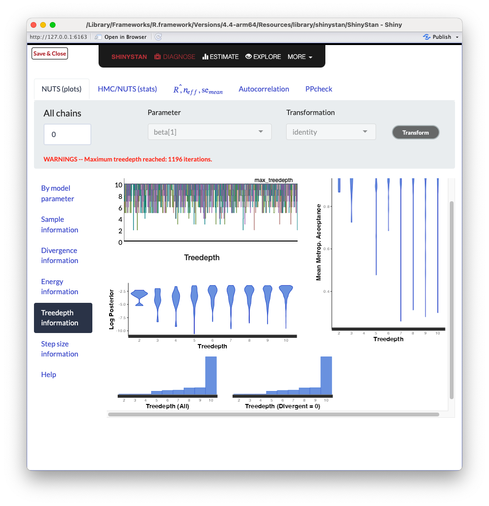
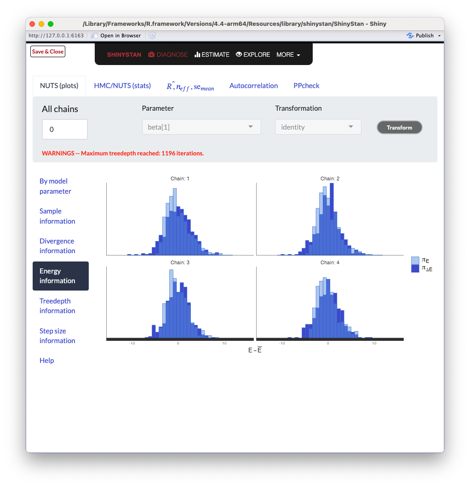
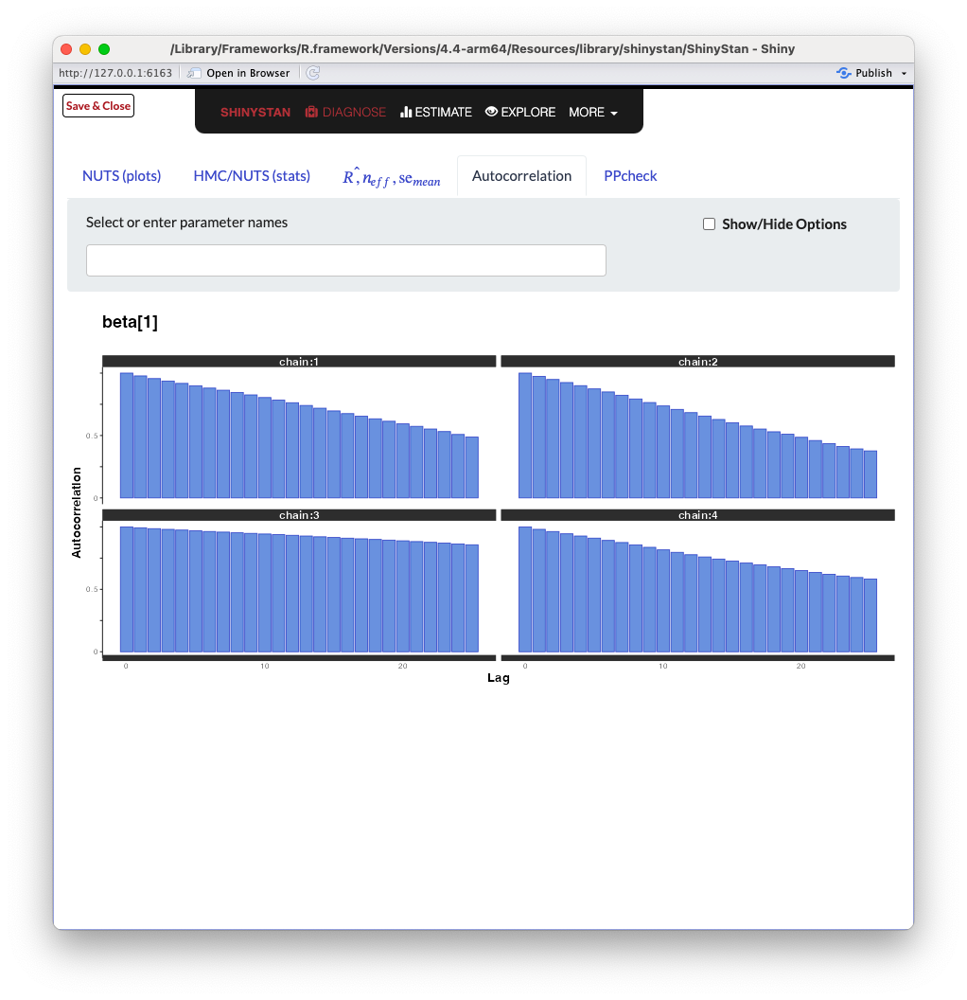

```{r libraries}
library(car)
library(tidyverse)
library(rstan)
library(cmdstanr)
library(shinystan)
library(brms)
```
## Bayesian Modeling

$$P(\Theta|X) \propto P(X|\Theta)P(\Theta)$$



## Markov Chain Monte Carlo {.smaller}

- Metropolis Hastings (MH)
    
    - Proposal distribution
    
    - Acceptance probability
  
. . .   
    
- Gibbs Sampling

    - Special case of MH

    - Conditional distributions
    
    - $P$(Acceptance)$=1$
    
. . .   
  
- **Hamiltonian Monte Carlo**

    - Special case of MH

    - Hamiltonian dynamics
    
    - $P$(Acceptance)$=1$*

## Hamiltonian Monte Carlo


## Hamiltonian Monte Carlo Continued {.smaller}

- MH with Hamiltonian Dynamics to propose movements
    
    - Randomly sample kinetic energy
    
    - Posterior $\approx$ potential energy field
    
    - Simulate trajectory using leapfrog integrator
    
    - Accept/reject proposed stopping point

. . .

- Lower correlation between samples

    - Physical model: travel further in the parameter space

    - Higher sampling efficiency

. . .

- Energy conservation: high acceptance probability


::: notes
- Momentum and kinetic energy used interchangeably, as they are 1-1 transforms for a fixed mass

- Leapfrog integrator uses model gradient to take steps, why it is important to keep this efficient (analytical gradients built-in by STAN for many things)

- MH step compensates for numerical issues in the Leapfrog algorithm, but acceptance probability should be high if things go well (not needed in perfect world). Acceptance probability is modified to include both posterior and momentum/particle "mass", if energy is preserved, it is 1. 
:::

## What is STAN?

- Bayesian probabilistic programming language

- Multiple posterior sampling routines

    - Hamiltonian Monte Carlo
      
        - Adaptive step size
    
    - Variational Inference
    
    - Laplace approximation

- Based on C++

- Interfaces with Python, Julia, R, and Unix Shell

:::{.notes}
Laplace approximation - approximate the distribution as a normal centered at the MAP using Taylor expansion.
:::

## Structure of a STAN Script

```{stan output.var="blank"}
#| eval: true
#| echo: true

functions {
  // ... function declarations and definitions ...
}
data {
  // ... declarations ...
}
transformed data {
   // ... declarations ... statements ...
}
parameters {
   // ... declarations ...
}
transformed parameters {
   // ... declarations ... statements ...
}
model {
   // ... declarations ... statements ...
}
generated quantities {
   // ... declarations ... statements ...
}
```

::: notes
All blocks are optional, an empty string is actually a valid STAN code.
Order is important, they must be in the above order
Variables have scope over all subsequent blocks
:::

## Section - functions

- Repeated sub-tasks

    - Code brevity

    - Parallelization
    
. . .

- Complex indexing

    - Sparsely observed data

. . .

- Suffixes for particular functions
    
    - Containing RNG: "_rng"
    
    - Modifying target density: "_lp" 

::: notes
RNG functions can only be used on data/generated quantities
:::

## Section - data

- Observed data

    - Corresponding indexing objects

- All constants

    - Array extents
    
- Commonly used linear transforms

::: notes
Often need more information in this block than you think to fully specify the model.
:::

## Section - transformed data

- Functions of data variables

    - e.g., eigenvalues of matrix

. . .

- Helpful for book-keeping

    - Simplify data inputs
    
. . .

- Only evaluated once

    - Prior to sampling

## Section - parameters

- Specify sampled quantities

    - Variable names
    
    - Any constraints

. . .

- Definitions only

. . .

- Can provide initial values

::: notes
- Will get more into how to provide initial values shortly

- Constraints are checked (will reject if not satisfied), not transformed to be enforced unless otherwise indicated
:::

## Section - transformed parameters

- Deterministic functions of parameters

. . .

- Good for re-parameterization

    - Parameter expansion
    
    - Centered / Non-centered

. . .    

- Evaluated with each sample
    
    - Transformation vs. Change of variables
    
    - Inverse transform and Log absolute Jacobian

::: notes
- Can include data, transformed data, and parameters as inputs

- NUTS and standard HMC prefer unconstrained parameters

- Tranformation: sample then transform, CoV: transform then sample

- Need inverse transform and log absolute Jacobian to be efficient, as they can greatly slow down the sampling process otherwise

- Natural scale vs sampling efficiency. However, gradient calculations usually dwarf these differences
:::

## Section - model

- Define the target posterior

    - Log density

. . .

- Prior distributions on (transformed) parameters

- Data/model likelihood

. . .

- Most computational expense

- ORDER MATTERS

::: notes
It is often important to know which subgroup of operations within the model block is consuming the majority of computation time (after deciding that efficiency is insufficient). We will get to how this can be done (do not optimize unless necessary).
:::

## Section - generated quantities

- Functions of model output

    - Predictions for new data
    
    - Simulations based on parameters
    
    - Extract posterior estimates
    
    - Calculate model fit criterion
    
. . .

- Executed after samples are generated
  
## Example Model - Simple GLM

```{stan output.var = "first_model"}
#| eval: true
#| echo: true

data {
  int N;  // Number of observations
  int P;  // Number of fixed effect covariates
  
  array[N] int<lower=0, upper=1> Y;  // Binary outcomes
  matrix[N, P] X;                    // Fixed effects design matrix
}
parameters {
   vector[P] beta;  // Coefficients
}
model {
   Y ~ bernoulli_logit(X * beta);
   // target += bernoulli_logit_lpmf(Y | X * beta);
}
```

::: notes
While there is no explicit prior on beta here, that just means that STAN is choosing the equivalent to a flat prior under the hood
:::

## Running the Model in R

```{r fitmod, echo=TRUE, warning=FALSE}
fit_df = mtcars %>%
  mutate(Efficient = case_when(mpg >= median(mpg) ~ 1,
                               TRUE ~ 0)) %>%
  mutate(am = as.factor(am))
fit_matrix = model.matrix(~cyl + disp + hp + drat + wt + am, fit_df)

data_list = list(N = nrow(mtcars), P = ncol(fit_matrix), 
                 Y = fit_df$Efficient, X = fit_matrix)

model = sampling(
  first_model, 
  data = data_list, 
  chains = 4, 
  iter = 1000, 
  warmup = 500, 
  # init = ,
  # control = list(...), 
  verbose = F,
  refresh = 0
)
```

## Reminder: Hamiltonian Dynamics


## Runtime Options - Adaptive HMC {.larger}


:::{.absolute top="20%"}
- adapt_delta: target acceptance probability in adaptation

- max_treedepth: bounds leapfrog steps

- stepsize_jitter: multiplier of adapted stepsize
:::

::: notes
Increasing adapt_delta leads to more accurate sampler, but slower

Increasing max_treedepth has a similar effect, it is in place to avoid excessively long computation times. Talk more about this shortly

Having a jitter to step-sizes (% either direction) can help get unstuck, or cause slow sampling/divergences
:::

## Diagnostics

```{r convergence_v1, echo=TRUE, warning=TRUE, message=TRUE}
check_hmc_diagnostics(model)
```

```{r summary_v1, echo=TRUE, warning=TRUE, message=TRUE}
summary(model)$summary[,"Rhat"]
```

## Divergences

- Simulated trajectory $\neq$ true trajectory

. . .

- Step size $>$ true posterior geometry resolution

    - Leapfrog first order approximation
    
. . .

- Hamiltonian departs from initial value

    - Total energy (kinetic + potential)
    
    - Should be preserved along trajectory

. . .

- Sampler may reject samples after divergence

## Tree Depth Warnings

- Tree depth controls number of simulation steps

    - $\leq 2^{max\_treedepth}$ steps
    
    - Keeps simulated trajectories finite

- Primarily an efficiency concern

. . . 

- Generally recommended to not increase

    - Often model misspecification

## Est. Bayesian Fraction of Miss. Info.

- Posterior decomposes into energy equivalence classes

. . .

- Low EBFMI indicates getting "stuck" in energy sets

    - STAN monitors the Hamiltonian during sampling

    - Chosen kinetic energies do not deviate enough

. . .

- Insufficiently exploring the posterior

    - Tails too large, etc
    
:::{.notes}
Tails stretch things out, elongate the distance between level sets.
:::

## Geometric Intuition

```{r intuition_figure}
samples = extract(model)

betas = map(1:dim(samples$beta)[1], function(x){
  return(data.frame(beta0 = samples$beta[x,5],
                    beta1 = samples$beta[x,6],
                    Sample = x))
}) %>% list_rbind()

betas %>%
  ggplot(aes(x = beta0, y = beta1)) + 
  geom_density_2d_filled() + 
  theme_classic() + 
  theme(legend.position = "none", 
        plot.margin = unit(c(0, 0, 0, 0), "inches")) + 
  labs(x = parse(text = "beta[4]~Axle~Ratio"), y = parse(text = "beta[5]~Weight"))
```

## Return to our Example: Model Outputs {.scrollable}

```{r permuted_mod_all, echo = TRUE}
samples = extract(model)

beta_0 = map(1:dim(samples$beta)[1], function(x){
  return(data.frame(beta0 = samples$beta[x,1], 
                    Sample = x))
}) %>% list_rbind()
```

```{r pma_vis, echo = FALSE}
beta_0 %>%
  ggplot(aes(x = beta0)) + 
  geom_histogram(aes(y=..density..), fill = "white", color = "black", position = "identity") +
  geom_density(aes(y=..density..), alpha = 0) + 
  theme_bw() + 
  labs(x = parse(text = "Intercept~beta[0]"), 
       y = "Distribution", 
       title = parse(text = "Posterior~of~beta[0]"))
```

## Model Outputs (2) {.scrollable}

```{r sampled_mod_single, echo = TRUE}
samples = extract(model, "beta", permuted = FALSE)

beta_0 = map(1:dim(samples)[1], function(x){
  return(data.frame(beta0 = samples[x,,1], 
                    Chain = 1:4, 
                    sample = x))
}) %>% list_rbind()
```

```{r sms_vis, echo = FALSE}
beta_0 %>%
  mutate(Chain = as.factor(Chain)) %>%
  filter(sample <= 200) %>%
  ggplot(aes(x = sample, y = beta0, color = Chain, group = Chain)) +
  geom_line() + 
  theme_bw() + 
  labs(x = "Sample", y = parse(text = "beta[0]"), 
       title = parse(text = "Trace~Plot~of~beta[0]"))
```

## ShinySTAN Debugging

```{r shinystan_start, echo=TRUE, eval=FALSE}
launch_shinystan(model)
```

{fig-align="center"}

## ShinySTAN - Summary

{fig-align="center"}

## ShinySTAN - Divergences

{fig-align="center"}

## ShinySTAN - Treedepth

{fig-align="center"}

## ShinySTAN - Energy

{fig-align="center"}

## ShinySTAN - Autocorrelation

{fig-align="center"}

## How to Update the Model

```{stan output.var = "second_model"}
#| eval: true
#| echo: true

data {
  int N;  // Number of observations
  int P;  // Number of fixed effect covariates
  
  array[N] int<lower=0, upper=1> Y;  // Binary outcomes
  matrix[N, P] X;                    // Fixed effects design matrix
}
transformed data {
  matrix[N, P] Q_coef = qr_thin_Q(X) * sqrt(N-1);
  matrix[P, P] R_coef = qr_thin_R(X) / sqrt(N-1);
}
parameters {
  vector[P] beta;  // Coefficients
}
transformed parameters{
  vector[P] theta = R_coef * beta;
}
model {
  beta ~ normal(0, 10);
  Y ~ bernoulli_logit(Q_coef * theta);
}
```

## Running the Updated Model

```{r fitmod2, echo=TRUE, message=FALSE}
model = sampling(
  second_model, 
  data = data_list, 
  chains = 4, 
  iter = 1000, 
  warmup = 500, 
  verbose = F,
  refresh = 0
)
```

## Updated Model Performance

```{r convergence_v2, echo=TRUE, warning=TRUE, message=TRUE}
check_hmc_diagnostics(model)
```

```{r summary_v2, echo=TRUE, warning=TRUE, message=TRUE}
summary(model)$summary[8:15,"Rhat"]
```

## Updated Model Visualization {.scrollable}

```{r vis_v2, echo=FALSE}
samples = extract(model)

beta_0 = map(1:dim(samples$beta)[1], function(x){
  return(data.frame(beta0 = samples$beta[x,1], 
                    Sample = x))
}) %>% list_rbind()

beta_0 %>%
  ggplot(aes(x = beta0)) + 
  geom_histogram(aes(y=..density..), fill = "white", color = "black", position = "identity") +
  geom_density(aes(y=..density..), alpha = 0) + 
  theme_bw() + 
  labs(x = parse(text = "Intercept~beta[0]"), 
       y = "Posterior Distribution", 
       title = parse(text = "Posterior~of~beta[0]"))


samples = extract(model, "beta", permuted = FALSE)

beta_0 = map(1:dim(samples)[1], function(x){
  return(data.frame(beta0 = samples[x,,1], 
                    Chain = 1:4, 
                    sample = x))
}) %>% list_rbind()

beta_0 %>%
  mutate(Chain = as.factor(Chain)) %>%
  filter(sample <= 200) %>%
  ggplot(aes(x = sample, y = beta0, color = Chain, group = Chain)) +
  geom_line() + 
  theme_bw() + 
  labs(x = "Sample", y = parse(text = "beta[0]"), 
       title = parse(text = "Trace~Plot~of~beta[0]"))
```

## Updated Geometry

```{r intuition_update}
samples = extract(model)

betas = map(1:dim(samples$beta)[1], function(x){
  return(data.frame(beta0 = samples$beta[x,5],
                    beta1 = samples$beta[x,6],
                    Sample = x))
}) %>% list_rbind()

betas %>%
  ggplot(aes(x = beta0, y = beta1)) + 
  geom_density_2d_filled() + 
  theme_classic() + 
  theme(legend.position = "none", 
        plot.margin = unit(c(0, 0, 0, 0), "inches")) + 
  labs(x = parse(text = "beta[4]~Axle~Ratio"), y = parse(text = "beta[5]~Weight"))
```

## BRMS - An Alternative {.scrollable}

```{r brms_regression, echo = TRUE, results='hide'}
brms_fit = brm(Efficient ~ cyl + disp + hp + drat + wt + am, 
                data = fit_df, family = bernoulli(), 
                silent = 2, refresh = 0, 
                cores = 4, chains = 4, iter = 1000)
```
```{r brms_reg_show, echo = TRUE}
stancode(brms_fit)
```

## BRMS - Diagnostics

```{r brms_init_out, echo = TRUE, message=TRUE}
check_hmc_diagnostics(brms_fit$fit)
rhat(brms_fit)
```

## BRMS - Updating Priors {.scrollable}

```{r brms_priors, echo = TRUE, results='hide'}
brms_update = brm(Efficient ~ cyl + disp + hp + drat + wt + am, 
                data = fit_df, family = bernoulli(), 
                silent = 2, refresh = 0, 
                cores = 4, chains = 4, iter = 1000, 
                prior = set_prior("normal(0, 10)", class = "b"))
```
```{r brms_update_show, echo = TRUE}
stancode(brms_update)
```


## BRMS - Updated Diagnostics

```{r brms_update_out, echo = TRUE, message=TRUE}
check_hmc_diagnostics(brms_update$fit)
rhat(brms_update)
```

## Profiling STAN Models with CmdStanR (1)

```{stan output.var="Profile_Mod"}
#| eval: true
#| echo: true

data {
  int N;  // Number of observations
  int P;  // Number of fixed effect covariates
  
  array[N] int<lower=0, upper=1> Y;  // Binary outcomes
  matrix[N, P] X;                    // Fixed effects design matrix
}
transformed data {
  matrix[N, P] Q_coef = qr_thin_Q(X) * sqrt(N-1);
  matrix[P, P] R_coef = qr_thin_R(X) / sqrt(N-1);
}
parameters {
  vector[P] beta;  // Coefficients
}
transformed parameters{
vector[P] theta;
  profile("Transform") {
    theta = R_coef * beta;
  }
}
model {
  profile("Priors") {
    beta ~ normal(0, 10);
  }
  profile("Likelihood") {
    target += bernoulli_logit_lpmf(Y| Q_coef * theta);
  }
}
```

## Profiling STAN Models with CmdStanR (2)

```{r profile_code1, echo=TRUE, eval=FALSE}
model = cmdstan_model("Profile_Mod.stan")
fit = model$sample(data = data_list, chains = 1)
fit$profiles()[[1]][,c(1,3,4,5,8)]
```

```{r profile_code2, output=FALSE}
model = cmdstan_model("Profile_Mod.stan")
fit = model$sample(data = data_list, chains = 1)
```

```{r profile_code3, echo=FALSE}
fit$profiles()[[1]][,c(1,3,4,5,8)]
```

## Resource Links

- [Bayesian Workflow](https://arxiv.org/pdf/2011.01808)

- [Introduction to HMC](https://arxiv.org/pdf/1701.02434)

- [STAN Manual](https://mc-stan.org/docs/reference-manual/)

- [BRMS Manual](https://cran.r-project.org/web/packages/brms/brms.pdf)

::: notes
Bayesian Workflow by Gelman et. al.

Intro to HMC by Michael Betancourt
:::